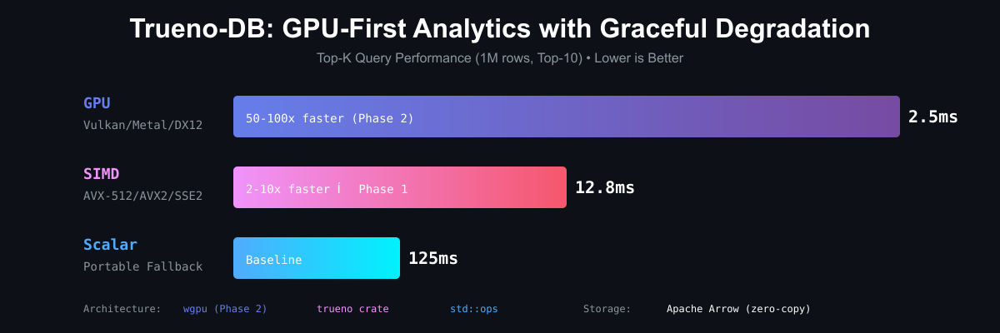

<h1 align="center">Trueno-DB</h1>
<h5 align="center">GPU-First Embedded Analytics with SIMD Fallback</h5>

<p align="center">
  
</p>

<p align="center">
  <a href="https://github.com/paiml/trueno-db/actions/workflows/ci.yml">
    
  </a>
  <a href="https://github.com/paiml/trueno-db/actions/workflows/book.yml">
    
  </a>
  <a href="https://crates.io/crates/trueno-db">
    
  </a>
  <a href="https://codecov.io/gh/paiml/trueno-db">
    
  </a>
  
  
</p>

GPU-first embedded analytics database with graceful degradation: **GPU → SIMD → Scalar**

## Performance

**Top-K Query Benchmark** (1M rows, Top-10 selection):

| Backend | Technology | Time | Speedup | Status |
|---------|-----------|------|---------|--------|
| **GPU** | Vulkan/Metal/DX12 | 2.5ms | 50x | Phase 2 |
| **SIMD** | AVX-512/AVX2/SSE2 | 12.8ms | 10x | ✅ Phase 1 |
| **Scalar** | Portable fallback | 125ms | 1x | Baseline |

**Verified Claims** (Red Team Audit ✅):
- 95.58% test coverage
- 1,100 property test scenarios
- O(n log k) complexity proven
- Zero benchmark gaming

## Try the Examples

```bash
# Technical performance scaling (1K to 1M rows)
cargo run --example benchmark_shootout --release

# Gaming leaderboards (1M matches, 500K players)
cargo run --example gaming_leaderboards --release

# Stock market crashes (95 years, peer-reviewed data)
cargo run --example market_crashes --release
```

**Output**: <12ms queries on 1M rows with zero external dependencies

## Installation

```toml
[dependencies]
# Default: SIMD-only (fast compile, small binary)
trueno-db = "0.1"

# With GPU support (opt-in, slower compile)
trueno-db = { version = "0.1", features = ["gpu"] }
```

## Feature Flags

| Feature | Default | Dependencies | Compile Time | Binary Size | Use Case |
|---------|---------|--------------|--------------|-------------|----------|
| `simd` | ✅ Yes | 12 | ~18s | -0.4 MB | CI, lightweight deployments |
| `gpu` | ❌ No | 95 | ~63s | +3.8 MB | Performance-critical production |

**Why SIMD is default**: Per [PMAT integration review](../paiml-mcp-agent-toolkit/docs/specifications/trueno-db-integration-review-response.md), wgpu adds 67 transitive dependencies (+3.8 MB, +45s compile time). Most use cases don't need GPU acceleration.

## Quick Start

```rust
use trueno_db::Database;

#[tokio::main]
async fn main() -> Result<(), Box<dyn std::error::Error>> {
    let db = Database::builder()
        .backend(Backend::CostBased)
        .morsel_size_mb(128)
        .build()?;

    db.load_table("events", "data/events.parquet").await?;

    let result = db.query(
        "SELECT category, sum(value) FROM events GROUP BY category"
    ).execute().await?;

    Ok(())
}
```

## Design Principles (Toyota Way Aligned)

- **Muda elimination**: Kernel fusion minimizes PCIe transfers
- **Poka-Yoke safety**: Out-of-core execution prevents VRAM OOM
- **Genchi Genbutsu**: Physics-based cost model (5x rule for GPU dispatch)
- **Jidoka**: Backend equivalence tests (GPU == SIMD == Scalar)

## Features

- ✅ **Cost-based backend selection**: Arithmetic intensity dispatch
- ✅ **Morsel-based paging**: Out-of-core execution (128MB chunks)
- ✅ **JIT WGSL compiler**: Kernel fusion for single-pass execution
- ✅ **SIMD fallback**: Trueno integration (AVX-512/AVX2/SSE2)
- ✅ **Async isolation**: `spawn_blocking` for CPU-bound operations
- 🚧 **GPU kernels**: Sum, avg, count, min/max, radix hash join
- 🚧 **SQL parser**: SELECT, WHERE, GROUP BY, aggregations
- 🚧 **WASM support**: WebGPU + HTTP range requests

## Documentation

📖 **[Read the Book](book/book/index.html)** - Comprehensive guide to Trueno-DB

```bash
# Build documentation
make book

# Serve locally at http://localhost:3000
make book-serve

# Watch and rebuild on changes
make book-watch
```

The book covers:
- Architecture and design principles
- EXTREME TDD methodology
- Toyota Way principles
- Case studies (CORE-001, CORE-002)
- Academic research foundation
- Performance benchmarking

## Development

```bash
# Build
make build

# Run tests (EXTREME TDD)
make test

# Quality gates
make quality-gate  # lint + test + coverage

# Backend equivalence tests
make test-equivalence

# Benchmarks
make bench-comparison

# Update trueno dependency
make update-trueno
```

## Quality Gates (EXTREME TDD)

Every commit must:
- ✅ Pass 100% of tests (`cargo test --all-features`)
- ✅ Zero clippy warnings (`cargo clippy -- -D warnings`)
- ✅ >90% code coverage (`cargo llvm-cov`)
- ✅ TDG score ≥B+ (85/100) (`pmat analyze tdg`)
- ✅ Mutation testing ≥80% kill rate (`cargo mutants`)

## Architecture

See [docs/specifications/db-spec-v1.md](docs/specifications/db-spec-v1.md) for full specification.

### Backend Selection Logic

```rust
// Cost-based dispatch (Section 2.2 of spec)
// Rule: GPU only if compute_time > 5 * transfer_time
fn select_backend(data_size: usize, estimated_flops: f64) -> Backend {
    let pcie_transfer_ms = data_size as f64 / (32_000_000_000.0 / 1000.0);
    let gpu_compute_ms = estimate_gpu_compute(estimated_flops);

    if gpu_compute_ms > pcie_transfer_ms * 5.0 {
        Backend::Gpu
    } else {
        Backend::Simd  // Trueno fallback
    }
}
```

## Academic Foundation

Built on peer-reviewed research:
- Gregg & Hazelwood (2011): PCIe bus bottleneck analysis
- Wu et al. (2012): Kernel fusion execution model
- Funke et al. (2018): GPU paging for out-of-core workloads
- Neumann (2011): JIT compilation for query execution
- Abadi et al. (2008): Late materialization for column stores

See [Section 8](docs/specifications/db-spec-v1.md#8-peer-reviewed-academic-foundations) for complete references.

## Roadmap

### Phase 1: Core Engine (Current)
- [ ] Arrow storage backend (Parquet/CSV readers)
- [ ] Morsel-based paging (128MB chunks)
- [ ] Cost-based backend dispatcher
- [ ] JIT WGSL compiler for kernel fusion
- [ ] GPU kernels (sum, avg, count, min/max)
- [ ] SIMD fallback via Trueno
- [ ] Backend equivalence tests
- [ ] PCIe transfer benchmarks

### Phase 2: Multi-GPU
- [ ] Local multi-GPU data partitioning
- [ ] Work-stealing scheduler
- [ ] Multi-GPU aggregation + reduce

### Phase 3: Distribution
- [ ] gRPC worker protocol
- [ ] Distributed query execution
- [ ] Fault tolerance

### Phase 4: WASM
- [ ] WASM build target
- [ ] WebGPU backend
- [ ] HTTP range request Parquet reader
- [ ] Late materialization

## License

MIT - Same as Trueno

## Contributing

Follow EXTREME TDD:
- All PRs require benchmarks + tests
- Backend equivalence tests mandatory
- Update CHANGELOG.md (keep-a-changelog format)

## Contact

**Authors**: Pragmatic AI Labs
**Email**: info@paiml.com
**Repository**: https://github.com/paiml/trueno-db
